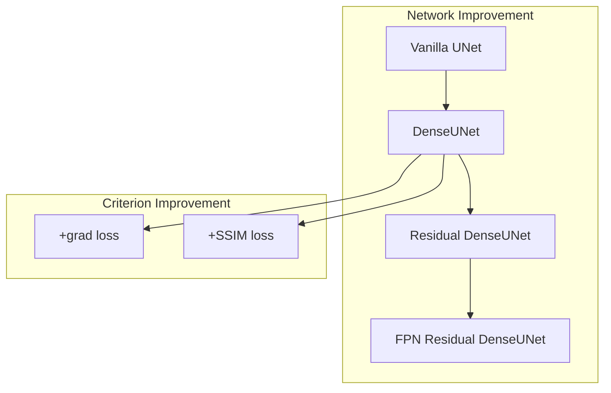

Ring Artifact UNet

---

A project for denoising ring artifact using various UNet variants.

# Model List

1. [Vanilla UNet](models/vanilla_unet.py)
2. [DenseUNet](models/dense_unet.py) ([+grad loss](models/dense_unet_gradloss.py))
3. [Residual DenseUNet](models/residual_dense_unet.py)
4. [FPN Residual DenseUNet](models/fpn_residual_dense_unet.py)



# Result

To be filled :)

# How to train

1. Requirements

    If you use uv, just `uv sync`

    Basically, you need:
    - python >= 3.10
    - torch >= 2.0
    - lightning >= 2.0
    - torchmetrics
    - tifffile
    - tensorboard

2. Put you data like:

    ```
    your_data_dir
    ├── train
    │   ├── label
    │   │    ├── 001-something-0001.tiff
    │   │    ├── 001-something-0002.tiff
    │   │    └── ...
    │   └── noisy
    │        ├── 001-something-0001-000.tiff  # one label for more than one noisy image for augmentation
    │        ├── 001-something-0001-001.tiff
    │        └── ...
    ├── val
    │   ├── label  # same as train
    │   └── noisy
    └── test
        ├── label
        └── noisy

3. Run `python train.py`

# How to generate synthetic data

To be developed :)
